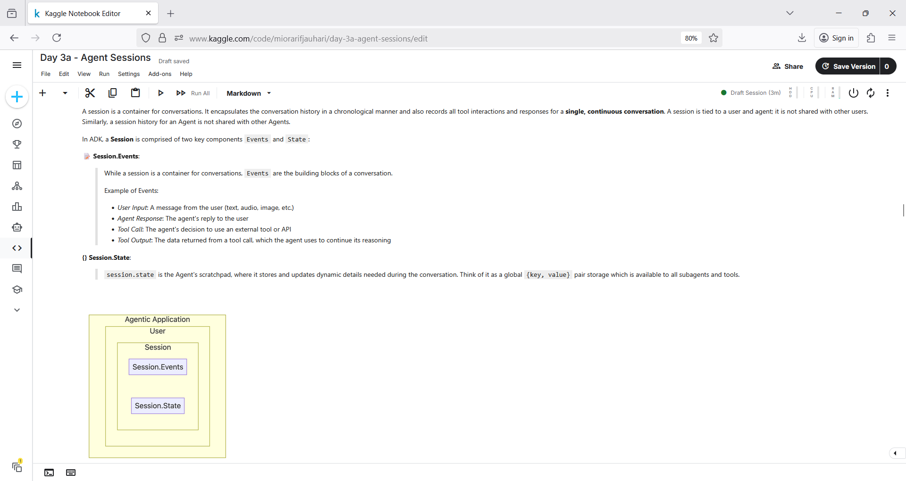
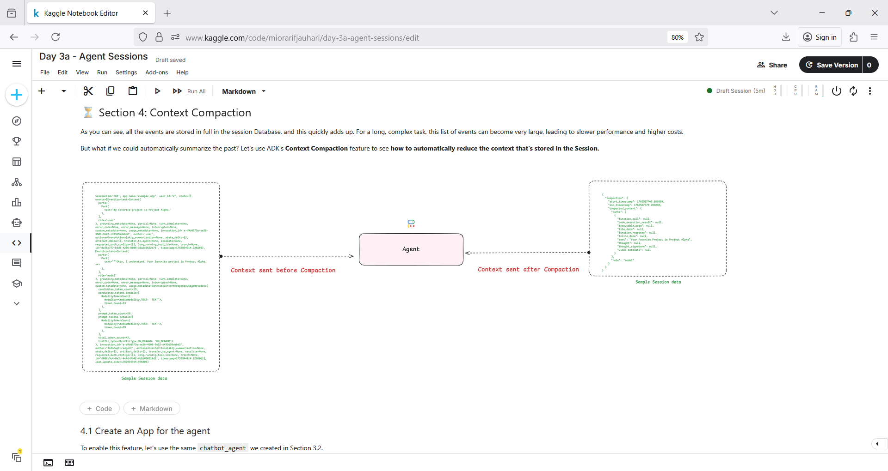
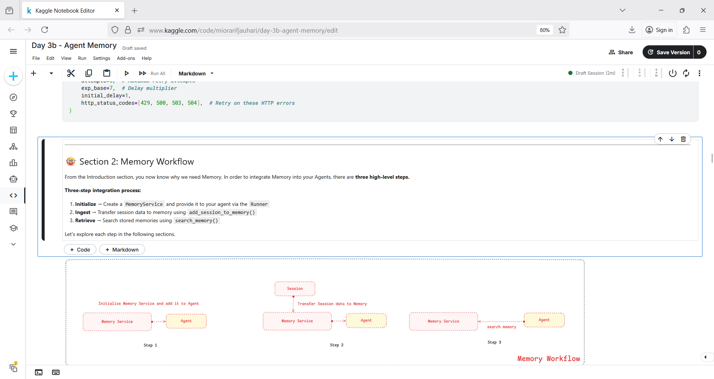
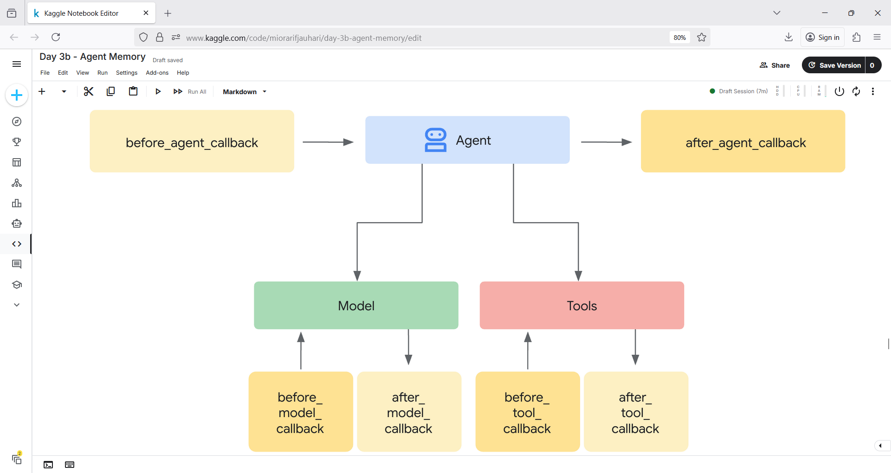
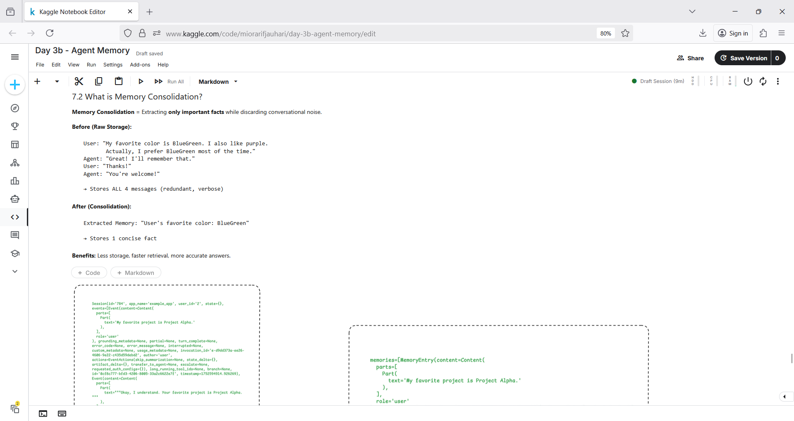

# aiaic_memory 🧑‍🏭🧠📚
aiaic_memory : Context Engineering # Session # Memory # Agent

## Objective
- Explore Context Engineering (Context Campaction)
- Build *stateful* agents with sessions and events
- Persist sessions in a database
- Initialize MemoryService & integrate with agent
- Automate memory storage & retrieval

## Context Engineering : Agent's Sessions & Memory

